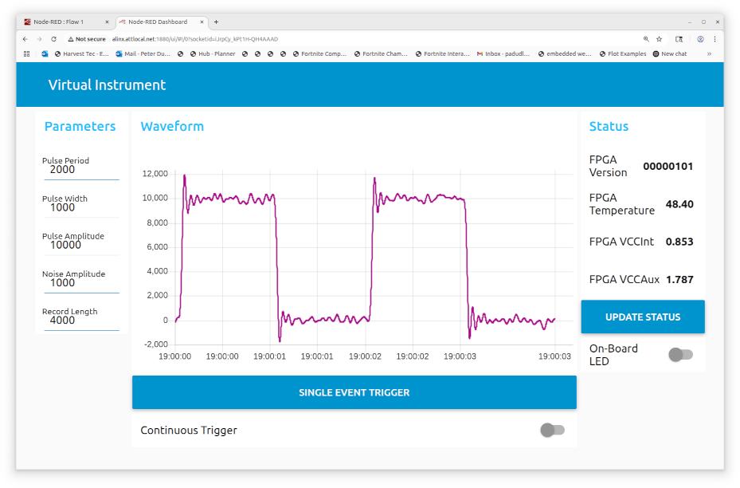

# Web User Interface
This folder contains a hidden .node-red folder with a Node-Red flow that controls and displays data from the virtual instrument in the FPGA fabric.

## Organization
This Node-Red flow must run as root so a symbolic link is made from /root/.node-red

    $ sudo su
    $ ln -s <path to checked out repository>/web_ui/.node-red /root/.node-red

When the .node-red folder is first checked out it is missing some of the dashboard nodes like buttons, switches, text and chart. To make the flow work it is necessary to run these commands.

    $ cd /root/.node-red
    $ npm install
    $ cd ..
    $ node-red

## Access
The flow workspace is accessed here: http://alinx.attlocal.net:1880/

The deployed webpage is accessed here: http://alinx.attlocal.net:1880/ui

Change the machine name to match your network.

